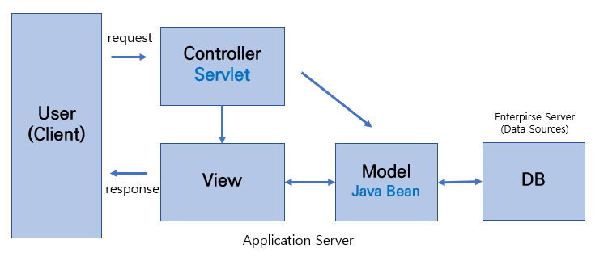
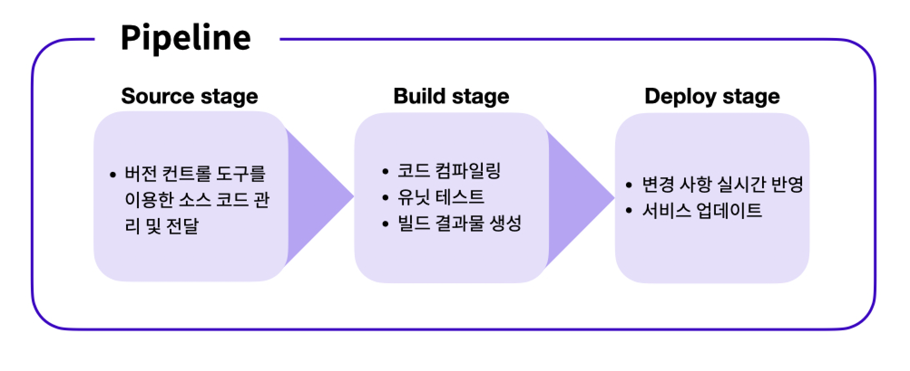

# 42gg 온보딩

- 1일차
    1. REST API 란 무엇인가? :
        
        *Representational State Transfer 의 약자
        
        *REST의 구성 :
        
        - **자원(RESOURCE)** - URI
        - **행위(Verb)** - HTTP METHOD
        - **표현(Representations)**
        
        *URI로 지정한 리소스에 대한 조작을 통일되고 한정적인 인터페이스로 수행하는 아키텍처 스타일
        
        *작업을 위한 상태정보를 따로 저장하고 관리하지 않습니다. 세션 정보나 쿠키정보를 별도로 저장하고 관리하지 않기 때문에 API 서버는 들어오는 요청만을 단순히 처리하면 됩니다. 
        
        *HTTP라는 기존 웹표준을 그대로 사용하기 때문에, 웹에서 사용하는 기존 인프라를 그대로 활용이 가능합니다. 따라서 HTTP가 가진 캐싱 기능이 적용 가능
        
        *REST API 메시지만 보고도 이를 쉽게 이해 할 수 있는 자체 표현 구조
        
        *REST 서버는 API 제공, 클라이언트는 사용자 인증이나 컨텍스트(세션, 로그인 정보)등을 직접 관리하는 구조로 각각의 역할이 확실히 구분되기 때문에 클라이언트와 서버에서 개발해야 할 내용이 명확해지고 서로간 의존성이 줄어듦
        
        *REST 서버는 다중 계층으로 구성될 수 있다.(보안, 로드 밸런싱, 암호화 계층 등)
        
        *PROXY, 게이트웨이 같은 네트워크 기반의 중간매체를 사용
        
        *REST API 핵심
        
        → URI는 정보의 자원을 표현해야 한다.**(리소스명은 동사보다는 명사를 사용)**
        
        → 자원에 대한 행위는 HTTP Method(GET, POST, PUT, DELETE)로 표현한다.
        
        예시 : 
        `GET /members/delete/1`(X)
        `DELETE /members/1`(O)
        
        *URI 설계 시 주의할 점
        
        →URI 마지막 문자로 슬래시(/)를 포함하지 않는다.
        
        URI에 포함되는 모든 글자는 리소스의 유일한 식별자로 사용되어야 하며 URI가 다르다는 것은 리소스가 다르다는 것이고, 역으로 리소스가 다르면 URI도 달라져야 합니다.
        
        → 밑줄(_)은 URI에 사용하지 않고 하이픈(-)은 URI 가독성을 높이는데 사용
        
        불가피하게 긴 URI경로를 사용하게 된다면 하이픈을 사용해 가독성을 높일 수 있습니다.
        
        글꼴에 따라 다르긴 하지만 밑줄은 보기 어렵거나 밑줄 때문에 문자가 가려지기도 합니다. 이런 문제를 피하기 위해 밑줄 대신 하이픈(-)을 사용하는 것이 좋습니다.
        
        → URI 경로에는 소문자가 적합하다.
        
        URI 경로에 대문자 사용은 피하도록 해야 합니다. 대소문자에 따라 다른 리소스로 인식하게 되기 때문입니다. RFC 3986(URI 문법 형식)은 URI 스키마와 호스트를 제외하고는 대소문자를 구별하도록 규정하기 때문이지요.
        
        → 파일 확장자는 URI에 포함시키지 않는다.
        
        `http://restapi.example.com/members/soccer/345/photo.jpg`(X)
        
        REST API에서는 메시지 바디 내용의 포맷을 나타내기 위한 파일 확장자를 URI 안에 포함시키지 않습니다. Accept header를 사용하도록 합시다.
        
        `GET / members/soccer/345/photo HTTP/1.1 Host: restapi.example.com Accept: image/jpg` (O)
        
        *도큐먼트 : 단순히 문서, 한 객체 이해하기
        
         컬렉션 : 문서들의 집합, 객체들의 집합이라고 이해하기
        
         컬렉션과 도큐먼트는 모두 리소스라고 표현할 수 있으며 URI에 표현됨
        
         예시 : `http:// restapi.example.com/sports/soccer`
        
        `http:// restapi.example.com/sports/soccer/players/13`
        
        → sports, players 컬렉션과 soccer, 13(13번인 선수)를 의미하는 도큐먼트
        
         **컬렉션은 복수**로 사용
        
         컬렉션과 도큐먼트를 사용할 때 단수 복수 지키기
        
    
    2. 쿠키와 세션, JWT토큰
    
    *쿠키
    
    → 사용자를 기억하기 위해 서버가 사용자의 브라우저에 저장하는 작은 기록 정보 파일
    
    → 서버의 response에 브라우저에 저장하고자하는 쿠키가 포함된다.(없기 가능), 쿠키엔 로그인 인증 뿐 아니라 웹사이트의 언어설정같은 여러 정보 저장 가능
    
    → 특징
    
    - 도메인에 따라 제한됨(네이버에서 준 쿠키는 네이버에서만 보내지게됨)
    - 유효기간이 있음(특, 브라우저가 종료되어도 인증이 유지됨)
    
    *세션
    
    → 서버에서 클라이언트별 유일한 세션 ID를 부여하고, 세션 정보를 서버에 저장한다.
    
    - 세션 ID : 사용자의 주요 정보가 아닌, 단지 사용자를 식별할 수 있는 값을 생성한다. → 보안 강화
    
    → 세션 ID는 클라이언트의 쿠키 값(세션 쿠키)으로 저장. 클라이언트에서 요청을 보낼 때 이 세션 쿠키를 함께 보냄.
    
    - 서버에서는 클라이언트별 세션 쿠키 값이 저장되어 있으니, 요청으로 온 세션 쿠키 값을 보고 어떤 클라이언트인지 식별할 수 있음.
    
    *JWT토큰
    
    → JSON Web Token의 줄임말. JSON으로 된 웹 토큰이라는 뜻
    
    → 사용자가 로그인을 하면 서버에서 토큰을 준다. 세션과는 다르게 서버가 기억하지않는다. JWT 토큰(Access Token)을 HTTP 헤더에 담아 서버가 클라이언트를 식별한다.
    
    → 헤더, 페이로드, 서명으로 구분된다. 
    
    - 페이로드는 claim이 포함되는 영역으로, 토큰에 담을 정보를 갖고 있다. claim이란 key-value 형식으로 이루어진 한 쌍의 정보로, 엔티티(주로 사용자)에 대한 속성을 설명한다.
    1. MVC, MVC2
        
        *MVC
        
        → Model **:** 처리한 작업의 결과 데이터를 클라이언트에게 응답으로 돌려주어야 하는데, **이 때 클라이언트에게 응답으로 돌려주는 작업의 처리 결과 데이터**를 Model이라고 한다.
        
        → View : Model을 이용하여 웹 브라우저와 같은 애플리케이션의 **화면에 보이는 리소스(Resource)를 제공**
        
        → Controller : 클라이언트 측의 요청을 직접적으로 전달받는 엔드포인드(Endpoint)로써 Model 데이터가 만들어지면 이 **Model 데이터를 View로 전달**하는 역할을 한다.
        
        *MVC1
        
        → 브라우저(사용자)로부터 요청이 들어오면 DB로부터 필요한 데이터를 받은 Model 객체(Java Bean)를 JSP 페이지(View)에 담아 응답으로 보내는 패턴
        
        → JSP가 View와 Controller 역할을 모두 담당하기 때문에 JSP 페이지 내에 너무 많은 코드가 들어가게 된다. 따라서, 코드의 가독성이 떨어질 뿐만 아니라 코드가 복잡해질 가능성이 있다.
        
        *MVC2
        
        
        
        → 요청을 하나의 컨트롤러(Servlet)가 먼저 받는다.
        
        → Servlet은 요청에 대한 비즈니스 로직을 처리한 후, 이를 JSP 파일에 반영하는 역할을 수행한다.
        
        *Spring MVC
        
        → 프론트 컨트롤러(Front Controller)가 우선적으로 클라이언트로부터 모든 요청을 받게 되며, 실제 요청의 처리는 **개별 컨트롤러 클래스로 위임**을 한다. 프론트 컨트롤러는 **받은 Model을 알맞은 View 템플릿으로 전달**하여 반영시키고, 최종적으로 클라이언트로 보낼 화면을 응답 결과로 전송한다.
        
        → 개별 컨트롤러 클래스는 핸들러(Handler)라고도 하며, DI를 통해 생성해둔 Bean을 통해 비즈니스 로직 처리 결과를 Model에 담아 다시 프론트 컨트롤러로 보낸다.
        
    2. 인프라
        
        *HTTPS
        
        →  HTTP의 보안 버전
        
        → HTTPS는 포트 443을 사용(HTTP는 80)
        
        → HTTPS는 암호화 프로토콜을 사용하여 통신을 암호화합니다. 이 프로토콜은 이전에는 보안 소켓 계층(SSL)으로 알려졌지만, 전송 계층 보안(TLS)이라고 불립니다.
        
         이 프로토콜은 비대칭 공개 키 인프라로 알려진 것을 사용하여 통신을 보호합니다. 이 유형의 보안 시스템에서는 두 개의 서로 다른 키를 사용하여 두 당사자 간의 통신을 암호화합니다.
        
        → 개인 키 : 이 키는 웹 사이트 소유자가 관리하며, 독자께서 짐작할 수 있듯이 비공개로 유지됩니다. 이 키는 웹 서버에 있으며 공개 키로 암호화된 정보를 해독하는 데 사용됩니다.
        
        → 공개 키 : 이 키는 안전한 방식으로 서버와 상호 작용하고자 하는 모든 사람이 사용할 수 있습니다. 공개 키로 암호화된 정보는 개인 키로만 해독할 수 있습니다.
        
        *DNS 서버
        
        → DNS : DNS는 브라우저가 입력한 호스트 이름 URL에 해당하는 올바른 IP 주소를 찾을 수 있도록 하는 도메인 이름 및 IP 주소 기록 시스템입니다.
        
        → 작동방식 : 웹 브라우저에 도메인 이름을 입력하면 컴퓨터는 해당 IP 주소를 얻기 위해 DNS 서버에 요청을 보냅니다. 그러면 DNS 서버는 데이터베이스를 검색하거나 다른 DNS 서버에 연결하여 도메인 이름과 연결된 IP 주소를 찾습니다. IP 주소를 찾으면 컴퓨터로 반환되어 요청된 웹사이트 또는 서비스에 연결할 수 있습니다.
        
        → 장점
        
        - DNS 서버는 IP 주소가 아닌 도메인을 입력하여 웹사이트를 찾는 데 도움을 줍니다.
        - 네트워크에 추가 보안 계층을 추가합니다.
        - DNS 서버가 없으면 온라인 거래가 불가능합니다.
        - 웹사이트가 IP 주소를 변경하면 DNS 서버가 이를 선택하고 데이터베이스를 자동으로 업데이트하므로 사용자는 영향을 받지 않습니다.
        - DNS 서버는 수행 속도가 빠르므로 사용자의 가동 중지 시간이 줄어듭니다.
        
        *CI/CD
        
        → CI
        
        - 지속적 통합(Continuous Integration)
        - push,  원격 코드 저장소로부터 코드를 가져와 유닛 테스트 후 빌드하는 단계, 코드 빌드의 결과물이 다른 컴포넌트와 잘 통합되는 지 확인하는 과정 에서 자동화를 생각해볼 수 있다.
        
        → CD
        
        - 지속적 배포(Continuous Delivery/Deployment)
        - 지속적 배포의 경우, 코드 변경 사항의 병합부터 프로덕션에 적합한 빌드 제공에 이르는 모든 단계로, 테스트 자동화와 코드 배포 자동화가 포함
        
        
